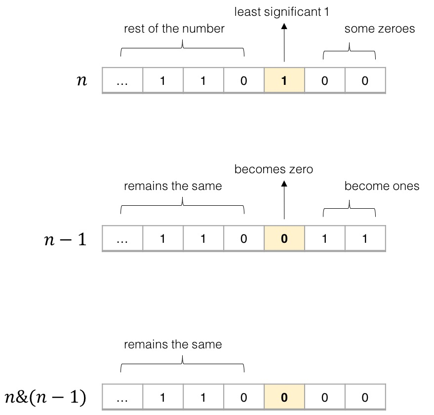

# [Number of 1 Bits Solution](https://leetcode.com/problems/number-of-1-bits/solution/)
## Approach 1: Bit Masking
### Algorithm
The solution is straight-forward. We check each of the 32 bits of the number. If the bit is 1, we add one to the number of 1-bits.  
  
We can check the i^{th} bit of a number using a *bit mask*. We start with a mask m = 1, because the binary representation of 1 is: ...00000001. Clearly, a logical AND between any number and the mask 1 gives us the least significant bit of this number. To check the next bit, we shift the mask to the left by one: ...00000010. And so on.  

### Implementation (Java)
```
public int hammingWeight(int n) {
    int bits = 0;
    int mask = 1;
    for (int i = 0; i < 32; i++) {
        if ((n & mask) != 0) {
            bits++;
        }
        mask <<= 1;
    }
    return bits;
}
```

### Complexity Analysis
The run time depends on the number of bits in *n*. Because *n* in this piece of code is a 32-bit integer, the time complexity is O(1).  
  
The space complexity is O(1), since no additional space is allocated.
  

## Approach 2: Bit Manipulation
### Algorithm
We can make the previous algorithm simpler and a little faster. Instead of checking every bit of the number, we repeatedly flip the least-significant 1-bit of the number, and add 1 to the sum. As soon as the number becomes 0, we know that it does not have any more 1-bits, and we return the sum.  
  
The key idea here is to realize that for any number of *n*, doing a bit-wise AND of *n* and *n-1* flips the least-significant 1-bit in *n* to 0. Why? Consider the binary representations of *n* and *n-1*.



In the binary representation, the least significant 1-bit in *n* always corresponds to a 0-bit in *n-1*. Therefore, ANDing the two numbers *n* and *n-1* always flips the least significant 1-bit in *n* to 0, and keeps all the other bits the same.  

Using this trick, the code becomes very simple.

### Implementation (Java)
```
public int hammingWeight(int n) {
    int sum = 0;
    while (n != 0) {
        sum++;
        n &= (n - 1);
    }
    return sum;
}
```

### Complexity Analysis
The run time depends on the number of 1-bits in *n*. In the worst case, all bits in *n* are 1-bits. In case of a 32-bit integer, the run time is O(1).  
The space complexity is O(1), since no additional space is allocated.
